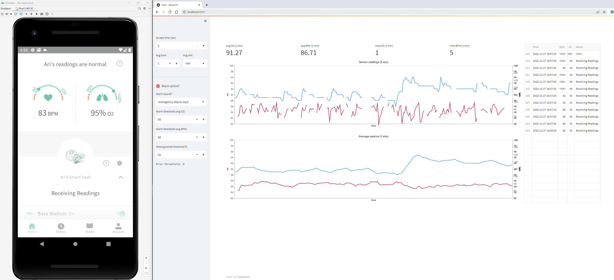

# Owlet sock - custom data visualisation and alarm dashboard with Streamlit and EasyOCR (PyTorch)



## Motivation

My daughter was hit with a more severe case of bronchiolitis requiring oxigen therapy.

During treatment O2 levels in the bloos need to be monitored. 
Fortunetly there is a consumer device, [The Owlet sock](https://www.owletcare.com/products/owlet-dream-sock) that can monitor heart rate (BPM) and O2% levels fairly accurately

Unfortunetly the app the device has does not come with a customizable level for alarm.
The built-in alarm at 80% is inadequate. There is also no API

## Solution and this project

Owlet app is run in an emulator is scraped for data via OCR and put into a dashboard for visualizations and alerts

## How to use

_Tested only on Windows_

0. Install :

- Python (3.10.8)
- create Virtual env and activate
- Install [PyTorch](https://pytorch.org/) (requirement for [EasyOCR](https://github.com/JaidedAI/EasyOCR)) see [doc](https://github.com/JaidedAI/EasyOCR#installation)
(_as of this writting was not working with Python 3.11_)
```
pip install -r requirements.txt
```  

1. Run Owlet App in an emulator locally

- Install [Android Studio](https://developer.android.com/studio)
- Create Device (from Device Manager) with Google Play store
- Install [Owlet app](https://play.google.com/store/apps/details?id=com.owletcare.owletcare&hl=en_US&gl=US)
- Login and run

2. Position the emulator in a permanent visible palce on the screen. do not obstruct it

3. Configure `app.conf` 

```
[default]
window_title = Emulator

[label_locations]
bpm = [[160, 540], [300, 610]]
o2 = [[430, 540], [540, 610]]
status = [[250, 960], [566, 1000]]
```

For `window_title` use a substring of the window name containing the Emulator.

`label_locations` represent the screen pixel coordinates of the boxes containing the data on BPM / O2 / status

Make a screenshot of the entire screen and then in an image editor find out the coordinates

Try out some coordinates then run
```bash
python debug.py
```

This will produce image slices in `./out/` folder. 

If these slices look clean, with the exact data for each label category the coordinates are good

4. Run 

```bash
streamlit run main.py
```
